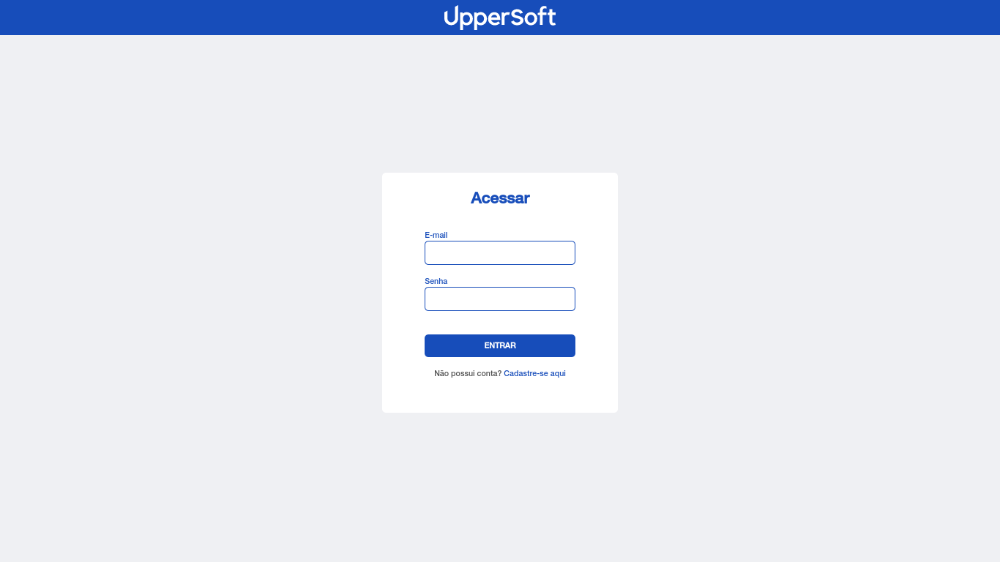
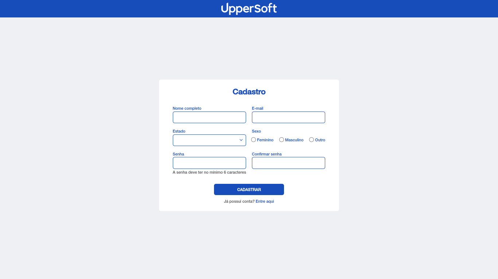
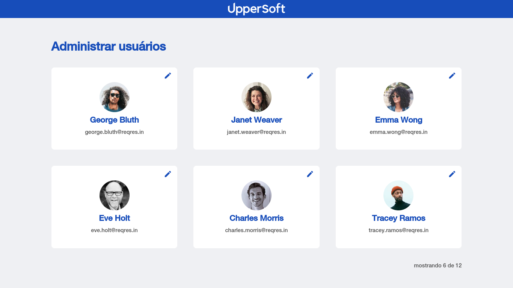

# InPeace Test FrontEnd

Este projeto é parte do processo seletivo da InPeace, do qual estou participando. Ele tem por objetivo simular uma aplicação que consiste em gerenciar usuários de um sistema.

As imagens abaixo mostram o resultado final das interfaces construídas:

     
    
    
    
     

Para a construção da interface foi utilizada a fonte Helvetica Neue nos tamanhos especificados e as cores fornecidas no teste.

## **Pré-requisitos**

- [x] Foram apresentados três arquivos HTML (**index.html, cadastro.html** e **lista-usuarios.html**).
- [x] O header se manteve fixo onde há scroll.
- [x] A tela é responsiva para mobile e desktop.
- [x] O botão de editar, no card de usuário na tela de Lista de Usuários, existe em forma de botão, mas não executa nenhuma ação.
- [x] Não foi utilizado nenhum framework de front-end.
- [x] Na tela de Login, ao clicar em entrar, ocorre o direcionamento para a tela de Lista de Usuários.
- [x] Na tela de Login, ao clicar em "cadastre-se aqui", houve o redirecionamento para a tela de Cadastro.
- [x] Na tela de Cadastro, ao clicar no botão de cadastrar, ocorre o direcionamento para a tela de Login.  Ao clicar em "entre aqui" ocorre o redirecionado para a tela de Login.
- [x] Os dados da **lista de usuário** foram obtidos por meio da integração com a API fake ([https://reqres.in/](https://reqres.in/)).
- [x] O e-mail e a senha cadastrados foram armazenados na SessionStorage e utilizou-se essas informações para realizar o login, com as devidas validações.
- [x] Foi utilizado o NPM para a instalação de bibliotecas.

## Plus

- [x] Foi utilizado o Axios para as requests.
- [x] Foi criada uma animação de Loading enquanto se aguarda a resposta da API.
- [x] Foi utilizado o pré-processador de CSS (SASS/SCSS)
- [x] Adicionou-se o favicon no projeto e atualizou-se o nome da aba de acordo com cada página.
- [x] Criação do efeito de hover dos botões (escurecem a cor ao passar o mouse por cima deles).
- [x] Na tela de cadastro, utilizou-se o clip-path no SCSS para gerar o ícone utilizado no select
- [x] Foi feita a validação de campos em branco, permitindo que os formulários de login e cadastro sejam submetidos apenas quando todos os campos forem preenchidos.
- [x] Foi feita a validação das senhas (com minlength) para que elas tenham pelo menos 6 caracteres (como mostrado na interface do cadastro) e para que a senha digitada seja igual à confirmação da senha.
- [x] Impediu-se o acesso à página de listagem de usuários (via URL, por exemplo) sem que o usuário passe pelo processo de cadastro e login.